<!-- GitHub profile README: shown on github.com/Michael1904 because the
     repository is named after the account. Pictures live in assets/. -->

### About

Full-stack developer. I build web products end to end — database, server logic, integrations and UI — with **TypeScript / Next.js**, **Python** and **PostgreSQL**.

Focused on systems that stay correct under failure: server-side validation, safe retries, transactional writes.

 

### Projects

  
  
  
  
  

  <picture>
    <source media="(prefers-color-scheme: dark)" srcset="https://raw.githubusercontent.com/Michael1904/Michael1904/output/github-snake-dark.svg" />
    
  </picture>

