<!-- GitHub profile README: shown on github.com/Michael1904 because the
     repository is named after the account. Pictures live in assets/. -->

### About

Hi, I'm Michael. I write web apps and backend services, mostly in TypeScript with Next.js and in Python, with PostgreSQL for data.

I like owning a feature from the database table to the button that uses it, and I try to leave code that the next person can pick up without asking me.

 

### Projects

#### 🌐 Community Platform &nbsp;

Website for an online gaming community. Players log in, buy things, set up their profile and read the docs, all in one place.

- Login through OAuth, with roles taken from the community's chat server
- Shop where prices are set on the server, every purchase gets a short order code, and orders nobody pays for get removed after a while
- Player profiles with a 3D character you can dress up
- Wiki with a text editor, page history, and a check so two people editing the same page don't overwrite each other
- Stats from play sessions: hours played, an activity heatmap, streaks and a leaderboard
- Bans are given for a specific rule, and the rule decides if a player can pay to lift the ban

#### 💳 Payment System &nbsp;

Bot that handles purchases after someone pays, so nobody has to give things out by hand.

- Reads payment notifications and checks the amount against the order before giving anything
- Gives the item on the game server through its remote console and adds the right role on the chat server
- Keeps track of subscriptions, reminds players before they run out and removes them when they end
- Items that need a person to look at them go to admins with approve and reject buttons, which keep working after a restart

#### 🛡️ Chat Moderation Bot &nbsp;

Bot that watches a community chat server and catches rule breaking as it happens.

- Checks messages against word lists and patterns, and asks Gemini about the unclear ones
- Gives warnings, and after a few warnings a timeout; moderators can act with one click
- Saves every action to a log, and trusted members can request a warning that a moderator then approves
- Word lists can be changed without restarting the bot

